<p align="center">
    <a href="https://git.io/typing-svg"></a>
</p>

## About me
```
Name: pixo2000 // Xandarian
Current_Projects: Coding Minecraft Gamemodes
Interests:
  - 🚁 System Management
  - 💻 Coding & Automation
  - 🎮 Gaming
Location: Germany
```

## GitHub Stats
<p align="center">
  <a href="https://github.com/pixo2000">
    
  </a>
  <a href="https://git.io/streak-stats"></a>
  <a href="https://github.com/pixo2000">
    
  </a>
</p>

<div align="center">
  
</div>


