<p align="center">
    <a href="https://git.io/typing-svg"></a>
</p>

## About me
```
Name: pixo2000 // Xandarian
Current_Projects: Coding Minecraft Gamemodes
Interests:
  - 🚁 System Management
  - 💻 Coding & Automation
  - 🎮 Gaming
Location: Germany, at my Computer
Contact: "xandarian" on Discord
```

## GitHub Stats

<div align="center">
  
</div>

<p align="center"><small> I use arch btw </small></p>
